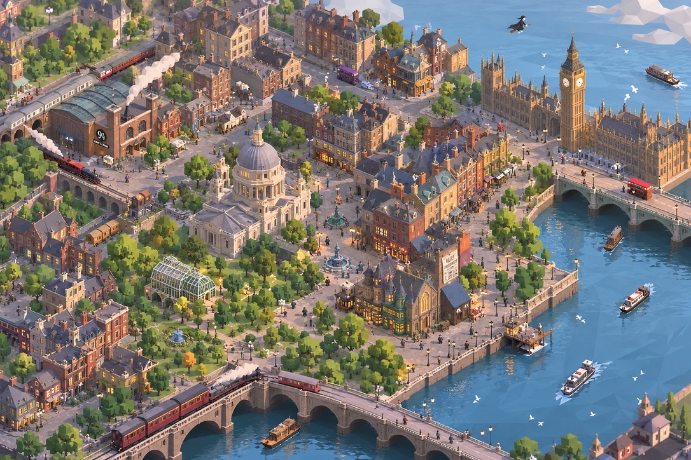

# MagicTown 视觉北极星：柔和等距城市模型

## 一句话

**从高斜视正交镜头看去，一座温暖、繁密、可观察的魔法伦敦微缩城市。**

它不是电影级写实城市鸟瞰，也不是像素小店拼贴；它应像一个能够被玩家和 Agent 持续扩建的低多边形城市模型。



## 参考图提炼

本项目的参考概念图体现了以下必须保留的特征：

1. **可整体阅读。** 正交高斜视镜头下，河流、铁路、桥、街道、广场和街区的关系一眼可读。
2. **城市由连续织物组成。** 联排建筑、路网、树木、广场和河岸彼此连接；地标突出，但不取代普通街区。
3. **低模而非粗糙。** 屋顶、墙面、水面和树冠都有清晰几何切面，细节用体块、色块和节奏表达，而非照片纹理。
4. **温暖均匀的可玩光照。** 午后主光塑造屋顶和街道，但不会把背街压成不可读的黑块。
5. **生命尺度。** 小人、火车、巴士、船、鸟、蒸汽和窗光说明城市持续运转。
6. **有呼吸的密度。** 街区可以繁密，但河岸、广场、公园和学院庭院必须形成留白。

## 视觉公式

```text
规则城市网格与道路
  + 连续低模街区
  + 柔和等距建筑资产
  + 河流、铁路、桥梁和树木
  + 轻量动态人物、车船、蒸汽与窗光
  = 可生长的魔法城市模型
```

## 相机与世界

- 相机固定为正交高斜视：`yaw 45°`、`elevation 55°`、`roll 0°`。
- 世界逻辑是二维方格；道路与建筑都占完整格。
- 地图边缘可以是圆角、河岸或云雾等自然曲线；不完整方格永远无效。
- 渲染时，格子沿浅弧面轻微下弯。弧度只制造模型感和有限视差，绝不改变寻路或地块逻辑。
- 建筑的相机变化范围受限：Depth Anything 深度与法线用于微小视差、明暗和起伏，不用于自由绕行。

## 建筑资产必须呈现的形体

每个生成资产在图像里都应同时有：

- 清楚的屋顶面；
- 一面主要立面与一面侧立面；
- 可读入口、窗户节奏、烟囱或店招；
- 与地块一致的台基、台阶或门前铺装；
- 不超过 1--3 个风格细节，例如温室、柳枝、藤蔓、圆窗、招牌或微弱魔法辉光。

不接受：正面平铺店铺、糖果色独栋童话屋、厚重照片纹理、黑色描边、霓虹泛光、无地块边界的插画。

## 色彩与材质

- 主体：伦敦砖红、深砖棕、暖石灰、板岩蓝灰、街道灰与河水蓝。
- 自然：低饱和树绿和花园绿，作为城市间的呼吸，不包围整座城市。
- 强调：暖窗金、交通红、少量魔法紫或青绿。
- 材质：高粗糙度、低镜面、纯色与几何切面为主；水面可有少量低模反射碎片。

## 对程序与生成资产的直接约束

- 低模程序层负责连续物：地面、格子、道路、河、桥、铁路、树、人、车、船、灯、云雾。
- 图像资产层负责独特建筑：店铺、联排、温室、学院、市场、地标。
- Agent 输出的是功能、地块、建筑语言与装饰意图；它不画坐标，也不直接写 mesh。
- 图像生成 Prompt 必须使用 `soft isometric low-poly urban diorama`，并锁定相机、地块、光照、建筑三面和禁用项。

## 视觉验收问题

1. 缩小到主镜头时，是否先读出城市结构，而不是一栋单独建筑？
2. 画面是否既像低模模型，又能让玩家相信其中道路、人、车与城市功能能运行？
3. 新建筑进入网格后，是否与邻近街区共享光照、比例和屋顶节奏？
4. Agent 的品味是否能通过街区关系、建筑形体和装饰直接看见，而非只在文字里出现？
