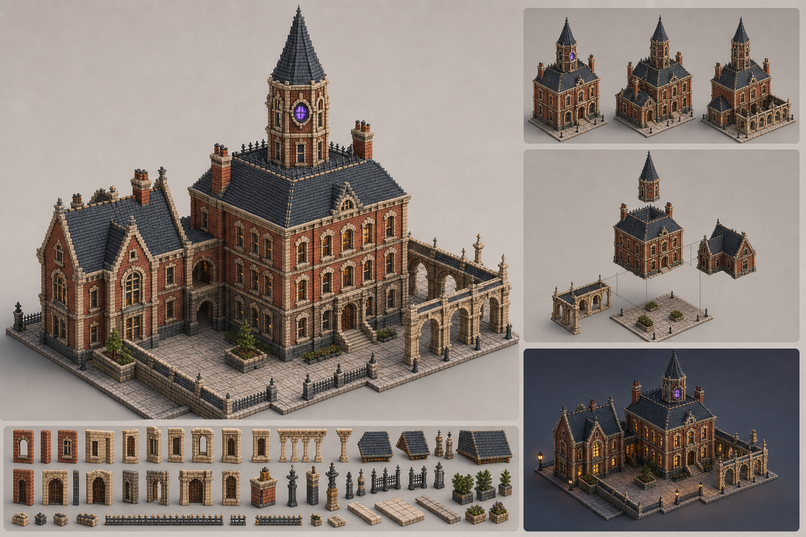
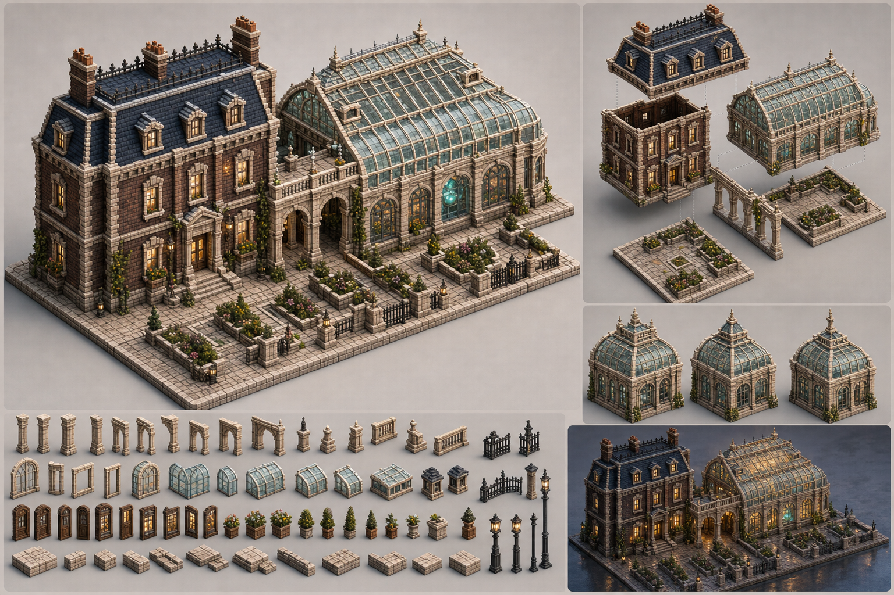
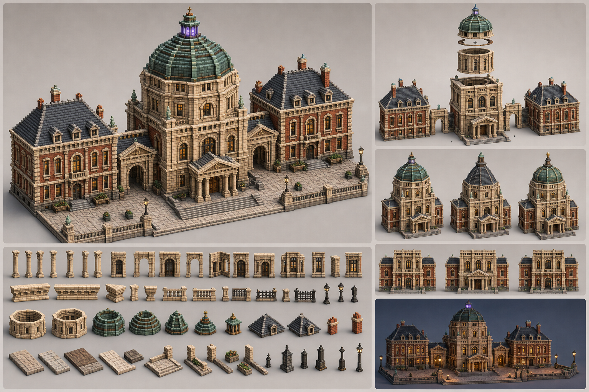
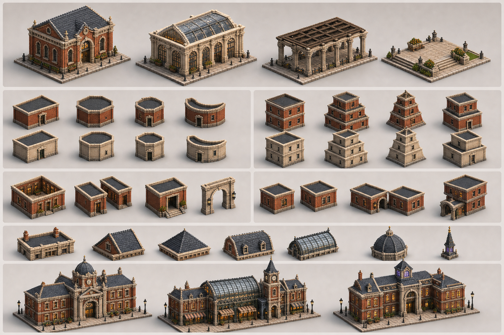

# 组合式体素建筑概念设计

这组概念图把 `UrbanMassingSpec v0.1` 的抽象能力翻译成可观察的建筑效果。
它们不是新增底层建筑类型，而是使用 `solid / framed / open / ground`、
标准空洞、顶部组件与组合关系构成的上层设计范例。

## 共同视觉合同

- 正交高斜视：`yaw 45° / elevation 55° / roll 0°`。
- 细颗粒体素负责拱券、窗套、檐口和屋顶阶梯，不采用 Minecraft 式大方块。
- 建筑主体保持伦敦砖红、深砖棕、暖砂岩、旧石灰和板岩蓝灰。
- 魔法紫或青绿只占局部视觉面积的 `2%–3%`，用于入口、塔灯或特殊窗。
- 每个组合都需要同时读出屋顶、正立面、侧立面、入口和地块边界。
- 模块接口不直接暴露成拼缝；使用檐口、墙柱、拱券、台阶或铺地变化完成收口。

## 1. 塔楼庭院 / 奥术学院



对应生成结构：

| 视觉部分 | 规格表达 |
| --- | --- |
| 三层主楼 | `solid + rectangular + hip` |
| 低矮侧翼 | `solid + rectangular + gable` |
| 八角收分塔 | `solid + octagonal + tapered + spire` |
| 沿院拱廊 | `open + columns + parapet` |
| 铺装庭院 | `ground + flat` |
| 塔楼落位 | `stacked(main, tower)` |
| 主楼与侧翼贯通 | `portal(main, side-wing)` |

设计重点：

- 塔楼只占宿主体量中部，保留一圈屋面退台，明确表达 `stacked`。
- 主楼、侧翼和拱廊分别使用不同檐高，组合后仍有连续的石材水平线。
- 庭院不是剩余空地；铺装、花池、围栏和入口轴线共同把它变成可读的 `ground` 组件。
- 魔法信号集中在塔身圆窗，避免整栋建筑被紫色接管。

## 2. 温室拱廊 / 炼金植物研究所



对应生成结构：

| 视觉部分 | 规格表达 |
| --- | --- |
| 砖石园艺楼 | `solid + rectangular + mansard` |
| 双格温室 | `framed + semicircle + glass_ridge` |
| 入口拱廊 | `open + columns + parapet` |
| 花园庭院 | `ground + flat` |
| 室内贯通 | `portal(garden-house, greenhouse)` |

设计重点：

- `framed` 的结构件必须比玻璃面板更强，远景先读出拱架和竖向节奏。
- 温室玻璃使用低饱和蓝绿与暖色室内，避免现代幕墙的冷硬反射。
- 玻璃顶脊、通风窗和端部半圆拱应成为 `glass_ridge` 的固定装饰槽。
- 植物只在花池和少量结构节点出现，不让随机藤蔓破坏构件边界。

## 3. 公共圆顶 / 魔法档案馆



对应生成结构：

| 视觉部分 | 规格表达 |
| --- | --- |
| 中央大厅 | `solid + rectangular + flat` |
| 左右侧翼 | `solid + rectangular + hip` |
| 八角鼓座 | `solid + octagonal` |
| 分段圆顶 | `dome` |
| 正门柱廊 | `open + columns + parapet` |
| 三格前广场 | `ground + flat` |
| 鼓座落位 | `stacked(central-hall, dome-drum)` |
| 两翼贯通 | 两组 `portal` |

设计重点：

- 公共建筑的识别来自中央轴线、入口尺度、两翼对称和顶部轮廓，而不是换成更鲜艳的材质。
- 圆顶应由清楚的分段环和肋条构成，保持体素可实现性，避免光滑半球。
- `entranceEmphasis` 同时影响门洞高度、台阶宽度、雨棚/山花和入口前的广场轴线。
- 侧翼用砖、中央体量用石，强化层级但仍共享窗台线和檐口线。

## 4. 体量语法图谱



图谱依次展示：

1. `solid / framed / open / ground` 四类基础体量；
2. `rectangular / chamfered / octagonal / semicircle` 平面；
3. `uniform / stepped / tapered / stacked` 垂直轮廓；
4. `courtyard / passage / recess / arch` 标准空洞；
5. `separate / adjoin / portal / stacked` 组合关系；
6. `flat / parapet / gable / hip / mansard / glass_ridge / dome / spire` 顶部组件；
7. 使用相同语法拼成的公共、市场与学院建筑。

## 对生成器细化的建议

### P0：让结构本身先成立

- 为相接体量建立统一的檐口、窗台和底座标高吸附规则。
- `portal` 除了切洞，还应生成洞口衬石、门槛和两侧收边。
- `stacked` 自动生成宿主屋顶收口、塔基泛水或矮女儿墙，隐藏穿插缝。
- `framed` 分离 `frameWidth / baySpacing / panelInset / roofVentChance`，避免只靠材料区别。
- 圆顶和尖塔使用离散轮廓模板，保证每一圈体素都形成稳定、可复现的剪影。

### P1：把功能意图变成建筑层级

- `facade.entranceEmphasis` 联动门洞、台阶、门廊和入口前铺装，而不只改变门宽。
- `facade.detailDensity` 分成结构细节、功能细节和装饰细节三档；缩放时可按档剔除。
- `ground` 增加铺装分区、边界、花池和排水槽等低矮组件，成为组合的一部分。
- 在 `solid ↔ framed`、`solid ↔ open` 接口提供固定过渡件：石柱、短墙、拱券或连廊。

### P2：形成上层设计套件

- `academic_courtyard`：砖石主楼 + 侧翼 + 叠置塔楼 + 拱廊 + 庭院。
- `botanic_institute`：园艺楼 + 玻璃厅 + 入口拱廊 + 花园地面。
- `civic_archive`：中央大厅 + 对称侧翼 + 圆顶鼓座 + 柱廊 + 广场。
- 套件只提供构图、材料和参数偏好；底层仍保存通用体量与关系，避免把用途写死进 grammar。

## 可复用生成提示词

四张图均以已有
`concept-images/voxel-building-system-concept-001.png`
作为风格与质量参考，而不是编辑目标。共同提示词为：

```text
Use case: stylized-concept
Asset type: architectural concept sheet for MagicTown's modular voxel building generator.
Camera: high three-quarter orthographic view; yaw 45 degrees; elevation 55 degrees;
roll 0; weak perspective at most.
Style: soft isometric low-poly urban diorama rendered as refined small-scale voxel
architecture; fine voxel resolution for arches, lintels, columns, cornices and roof
steps; crisp facets; clean ambient occlusion; no black outlines.
Palette: London brick red, deep brick brown, warm sandstone, aged limestone,
slate blue-grey, dark iron, pale desaturated glass and warm window gold.
Lighting: warm diffuse London afternoon with cool blue-grey shadows.
Constraints: clear roof, front and side faces; consistent parcel scale; buildable
voxel geometry; no text, labels, UI or watermark.
Avoid: Minecraft chunkiness, medieval fantasy village, candy colors, global magic
colors, neon bloom, modern curtain walls, photoreal textures and heavy grime.
```

各图在共同提示词上分别追加：

```text
TOWER COURTYARD: connected 2x2 parcel; solid hipped main hall, solid cross-gabled
side wing, slender stacked octagonal tapered tower with spire, open limestone
arcade and ground courtyard; include hero, exploded assembly, three silhouettes,
dusk study and reusable parts; portal and stacked relations must remain readable.

GREENHOUSE ARCADE: connected 3x2 parcel; solid mansard garden house, two-cell
framed semicircular greenhouse with pale limestone frame and glass-ridge cap,
open entry arcade and ground garden court; include hero, exploded assembly,
frame/cap variants, dusk study and reusable frame/glass/paving parts.

CIVIC DOME: connected 3x2 parcel; symmetrical central stone hall, two lower brick
hip-roofed wings, stacked octagonal drum with faceted dome, open front portico and
three-cell civic plaza; include hero, exploded assembly, dome variants, facade
study, dusk view and reusable civic components.

GRAMMAR ATLAS: a text-free systematic board showing the four mass types, four
plan shapes, four vertical profiles, courtyard/passage/recess/arch voids,
separate/adjoin/portal/stacked relations, all cap families and three finished
combinations, all at consistent scale and using real material colors.
```
