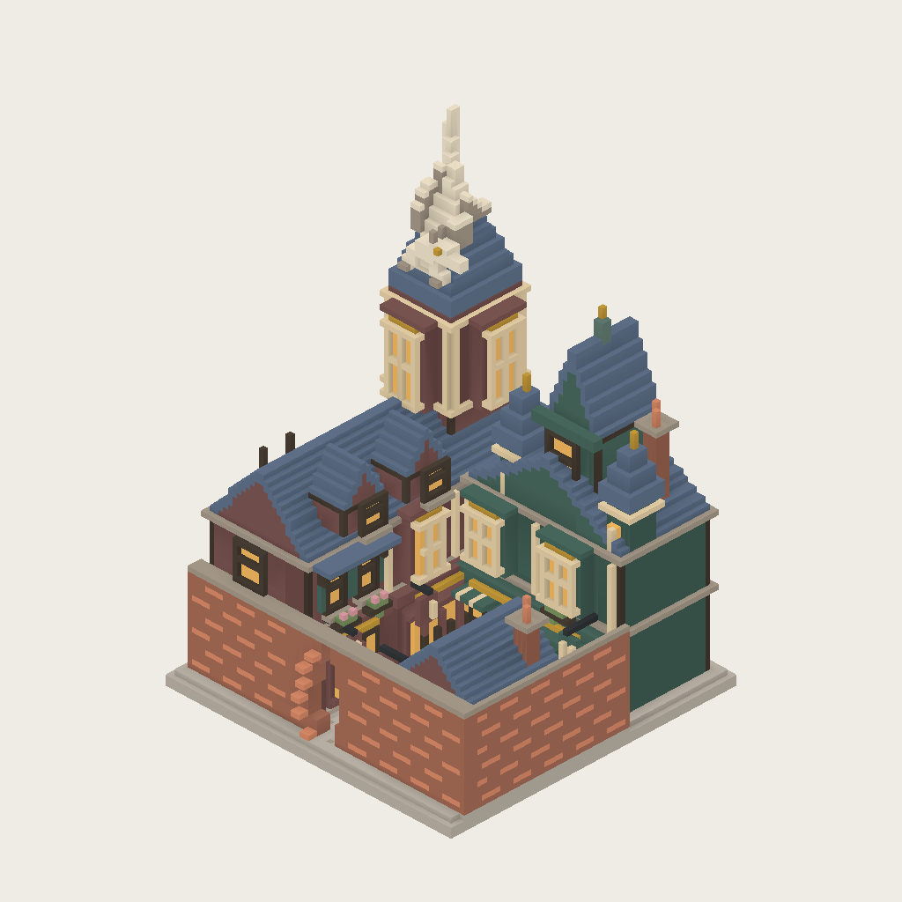
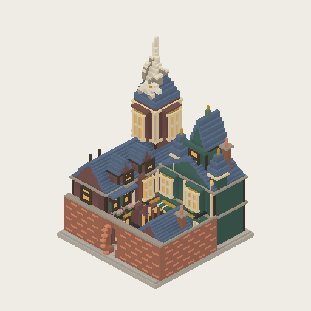
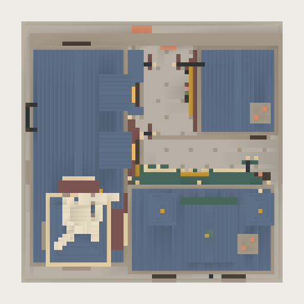
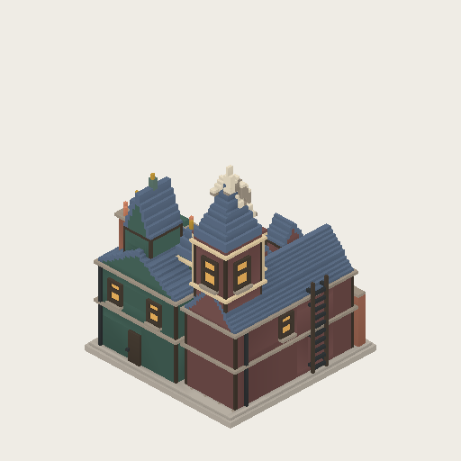

# 斜角巷 · 2×2 体素商业街（第十版）

两层魔杖店、带高阁楼的书店、低矮药剂店夹出一条 L 形内部巷道，魔杖店后部增加独立高塔体量，形成地标。入口朝 +Z，地块为 8×8 世界单位。临街砖墙定格在正在打开的状态：不规则窄缝、前后错动砖端，保留隐蔽感，不含动画。巷道先向里再右转，保持第二版收窄后的布局。

延续第三版整栋酒红、墨绿配色和凸窗装饰。第四版移除酒红主楼的悬挑第三层与大老虎窗，将主体降至两层，后部新增高塔：细长双面凸窗、分层檐口、陡尖顶及金属风向标。墨绿店铺的小塔作为陪衬，形成前低后高的主次关系。

第五版为酒红主楼增加两扇小老虎窗，在内巷增加三处花箱、折叠遮棚、货桶与包裹。塔顶风向标替换为浅石色飞龙雕塑，采用上扬双翼、长颈吻部与尾巴，保持整数体素。512 图可辨翼形与头颈，但爪、鳞片等细节不追求；属于小尺度轮廓试作，非精细生物模型。

第六版将飞龙改为攀附姿态：移除塔尖底座，身体降低到前侧坡面，双爪和卷尾依据真实屋顶高度场贴合台阶；头颈及双翼仍抬起，尖顶从身体后方露出。

第七版将腹部沿屋顶高度场贴伏，四爪扣住坡面，头颈侧转朝向巷子，双翼沿背部纵向收拢。酒红店铺内侧增加临近入口的橱窗、门和吊牌，外侧隐蔽砖墙不变。81 项相关测试与生产构建通过。

第八版将龙尾卷向天空，保留贴伏姿态；入口店铺二楼新增成对窄窗、墨绿窗板、浅挑板岩雨棚与两只花箱，和邻铺浅砂色凸窗形成区别。重跑 3 项资产测试与生产构建通过。

第九版将侧围墙放在独立的 x=31 体素列，避开房屋 x=30 檐口；砖色、错缝节奏和顶部压边与正面一致。房屋和随机种子保持不变，背面已有木质服务门予以保留。新增围墙/檐口分离与砖纹断言，3 项资产测试和构建通过。

第十版移除尾根残留的贴坡低位绕行段，尾巴直接从臀部上卷，消除背面双尾错觉。酒红楼外侧新增木侧梁、铁踏棍检修梯，避开窗户和落水管，扶手伸出屋檐。新增旧尾段移除、尾尖和梯子断言；3 项资产测试与构建通过。









## 配色与实现

- 整栋酒红、墨绿墙面，旧红砖入口，共用蓝灰板岩屋顶和暖琥珀窗光；浅砂色仅作窄饰边，不作大面积墙底。
- 新增 `shopGreen`、`shopWine` 哑光漆木材质，用于底层店面和吊牌；使用既有 painted 表面着色，非金属、非自发光。
- `src/generators/diagonAlley.js` 是固定资产源，复用 UrbanMassingSpec、VoxelInstanceBuffer 与 greedy meshing；所有面位于 0.125 体素网格。
- 10292 三角形；已有/新建 2×2 斜角巷、放置预览、CPU 可视化共用工厂。非 2×2 历史记录保留旧路径。
- 不改变卡牌遮蔽效果、成本或其他玩法。巷道为资产内部视觉空间，不写入城市道路网络。
- CPU 预览采用简化日光，不完整代表游戏内 AO、动态阴影和夜间发光。

## 再生成

```sh
pnpm visualize:building public/generated/diagon-alley-001/asset.json docs/visual-development/diagon-alley-001/front.png front 1024
pnpm visualize:building public/generated/diagon-alley-001/asset.json docs/visual-development/diagon-alley-001/top.png top 512
pnpm visualize:building public/generated/diagon-alley-001/asset.json docs/visual-development/diagon-alley-001/back.png back 512
```

测试覆盖四向边界、体素网格、面数预算、入口窄缝与错位砖端、上层墙面配色、内巷两段及转角连续净空，以及城市/预览/可视化一致性。
