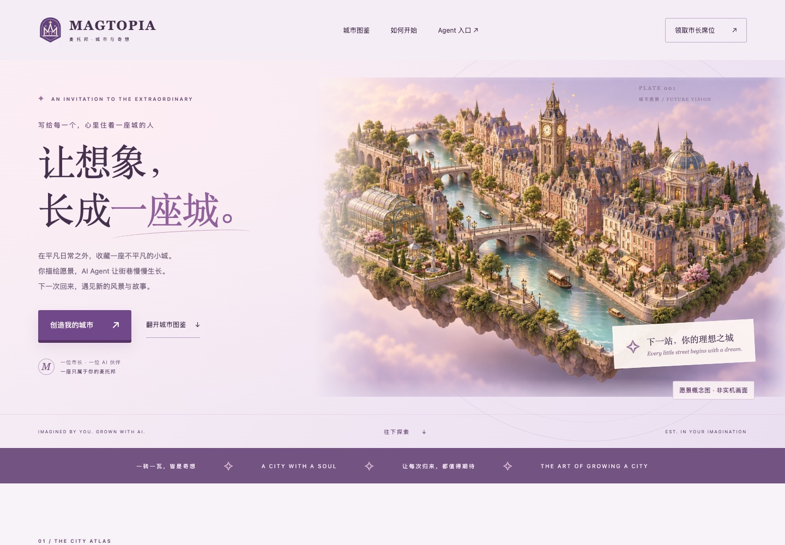

# MAGTOPIA 首页视觉迭代评审

日期：2026-09-19 至 2026-09-20。用户要求每轮完成后使用 GPT-5.6 Sol 独立视觉评审，达到 9/10 才结束。

评审代理：`visual_review`，模型 `gpt-5.6-sol`，reasoning effort `high`。每轮读取真实桌面、390px、360px 截图，要求独立评分，不以目标分数降低标准。

| 轮次 | 总分 | 主要反馈与处理 |
| --- | --- | --- |
| 基线 | 7.1 | 品牌不突出、样板空旷、下半页模板化。重绘市政徽章，添加明确标识的城市愿景图，建立城市图鉴、手记、邀请函。 |
| 第一轮 | 8.4 | 概念与实机落差、缺少可见成长过程、手机微文案太小。原生渲染器关闭景深重拍；加入同机位分阶段演示；增强标识可读性。 |
| 第二轮 | 8.8 | 移动端太长，连续阶段图重复，实机缺少品牌锚点。改为三联市政档案；加入可打开档案的学院钟楼热点；压缩手机布局。 |
| 第三轮 | **9.1** | 通过 9/10 视觉基线。 |

## 第三轮独立结论

> 第三轮独立复评：9.1/10，达到 9 分。

- Logo / 品牌：9.2
- 主视觉：9.3
- 实机与成长叙事：8.9
- 排版：9.1
- 移动端：9.0

评审依据：市政徽章、粉紫纸面、星芒标记、学院钟楼、手记与邀请函形成连续品牌识别；愿景图提供城市吸引力，真实样板和地标热点展示实际产品；概念与实机区分清晰；移动端三联档案缩短页面且保留叙事；页面已摆脱通用 SaaS 模板。

后续可提升但不阻碍通过：360px 三联图建筑变化需要细看；未来可让钟楼本体的魔法表现与 UI 呼应；愿景与实机美术精度仍不同，但有清晰标注和独立图鉴。

## 最终预览

## 证据与复现

- 每轮截图：`artifacts/homepage/round-1/`、`round-2/`、`round-3/`。
- 最终检查截图：`artifacts/homepage/verified/`。
- 启动本地临时内存预览：`node scripts/preview-home.mjs`，默认 127.0.0.1:4192。
- 视觉/交互检查：`node scripts/check-home.mjs verified`。
- 路由与静态资产检查：`node --test test/homePage.test.js`。
- 城市样板重拍：先启动 Vite 4178，再运行 `node scripts/capture-home-city.mjs`。

愿景图片使用内置 ImageGen 生成，完整 prompt、素材用途和实机来源见 `public/brand/README.md`。阶段图是同一原生渲染场景逐步显示建筑的布局演示，不是城市自动演进的录像。未发布到正式域名。
