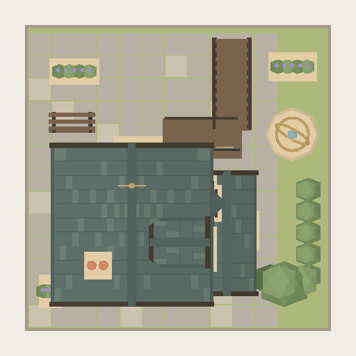

# 魔法部 · Tudor 魔法阁

固定资产 `ministry-tudor-001`，2×2 逻辑格（8×8 世界单位），三层；Y=0 落地，门朝 +Z。根据提供的 Tudor 微缩建筑参考，保留收窄底层、上层出挑、外置楼梯、陡山墙与烟囱。前庭为石板广场，东侧为星仪花园；木框奶油墙、灰绿瓦顶沿用项目日光配色。




这些图片由项目 CPU 轻量渲染器直接生成，几何与城市、放置预览共用同一个工厂。它们使用简化日光；游戏中的动态光照与阴影不体现在此预览中。

## 再生成

```sh
pnpm visualize:building public/generated/ministry-tudor-001/asset.json docs/visual-development/ministry-tudor-001/front.png front 1024
pnpm visualize:building public/generated/ministry-tudor-001/asset.json docs/visual-development/ministry-tudor-001/back.png back 512
pnpm visualize:building public/generated/ministry-tudor-001/asset.json docs/visual-development/ministry-tudor-001/top.png top 512
```

## 接入与预算

- `src/generators/ministryOfMagic.js` 是模型源；12268 三角形，2 个合并网格 / 材质，零贴图、零额外灯光。
- `specialStructure.cardId === "ministry-of-magic"` 且占地 2×2 时，城市直接选用固定资产，已有城市也适用。历史非 2×2 记录继续走原渲染路径。
- 放置预览通过现有 resolver 的 `prefab` 类型使用同一几何，支持四个入口方向和球面摆放。
- 渲染 CLI 接受资产描述文件；`landmark_prefab` 只提供受控的固定资产选择，不改变普通建筑生成 API。
- 当前环境单张 1024 预览约 0.25 秒，512 预览约 0.16–0.18 秒（含模型编译，不含 worker 启动）；仅为测量值，不保证其他设备相同。
- 54 项相关测试通过，生产构建通过。覆盖四向边界、几何预算、日夜窗光、真实城市接入、放置预览一致性、球面投影与三视图确定性。

本次不更改魔法部的招募、席位、成本或其他游戏效果。
