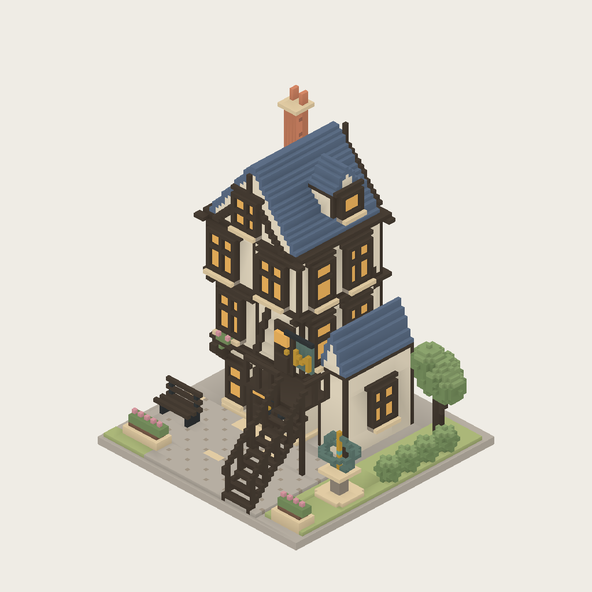
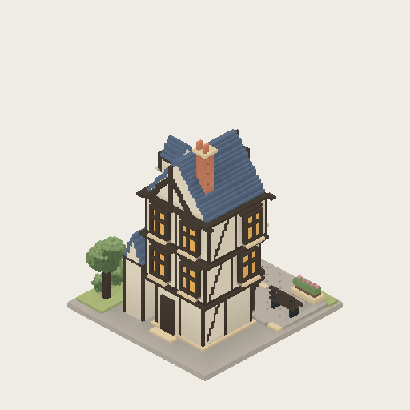
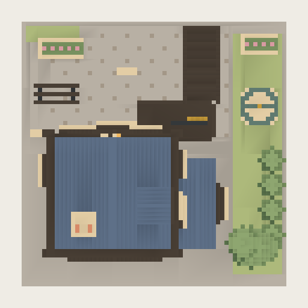

# 魔法部 · Tudor 体素魔法阁（v3）

固定资产 `ministry-tudor-001`，2×2 逻辑格（8×8 世界单位），三层；门朝 +Z。根据提供的 Tudor 微缩模型参考，保留收窄底层、上层出挑、外置楼梯、陡山墙与烟囱。前庭为石板广场，东侧为星仪花园。

v2 已完全替换最初的低多边形实现：主体直接使用公共建筑的 `UrbanMassingSpec`，所有附属细节写入同一个 `VoxelInstanceBuffer`，再统一剔除隐藏面、贪心合并。屋顶、斜撑、星仪、树冠全部由 0.125 网格上的轴对齐体素面构成，没有圆柱、球面或倾斜三角面。

v3 对齐现有公共建筑的材质用途：蓝灰 `slate` 屋顶、暖米色 `limestone` 墙面、`timber` 木构与统一 `warmWindow` 窗面。初版的铜绿窗面加单个暖黄窗格原是“局部亮灯”的表达，但看起来像拼色，且铜绿金属不应该充当玻璃，因此已移除；铜绿与金色只保留在庭院星仪和部徽等小面积五金上。窗框改为一体素细框，窗面内凹，托木、檐口、窗台花箱与烟囱细节同时精修。材质颜色、粗糙度、金属度与日夜发光参数复用共享公共建筑管线，不添加专属 RGB。







这些图片由项目 CPU 轻量渲染器直接生成，几何与城市、放置预览共用同一个工厂。预览使用简化日光；游戏中的材质着色、环境遮蔽与动态阴影不完全体现在这里。

## 再生成

```sh
pnpm visualize:building public/generated/ministry-tudor-001/asset.json docs/visual-development/ministry-tudor-001/refined-front.png front 1024
pnpm visualize:building public/generated/ministry-tudor-001/asset.json docs/visual-development/ministry-tudor-001/refined-back.png back 512
pnpm visualize:building public/generated/ministry-tudor-001/asset.json docs/visual-development/ministry-tudor-001/refined-top.png top 512
```

## 接入与预算

- `src/generators/ministryOfMagic.js` 为权威资产源。公共语法控制分层体量、堆叠关系、屋顶高度场与庭院地面；定制体素细节控制 Tudor 木构、门窗、楼梯与园景。
- `facade.enabled: false` 允许这个固定地标自绘门窗，避免默认开窗与手工立面叠加；普通公共建筑的默认行为保持不变。
- `voxelDetailPass` 是模型工厂内部的 JavaScript 回调，在表面剔除前写入体素，不是对外 JSON API。
- 使用现有公共建筑材质、日夜窗光、体素 AO 和 greedy meshing；9722 三角形、9 次绘制，零贴图、零额外点光源。
- 已有和新建的 2×2 魔法部通过特殊卡身份选取该固定资产；放置预览与城市、CLI 共用同一工厂。历史非 2×2 记录保持原路径。
- 与公共建筑一致，地块基底在 Y=-0.25..0，主体从 Y=0 起。入口支持四向旋转，整体保持球面摆放。
- 本机测得 1024 预览约 0.44 秒，512 背面约 0.29 秒（包含模型编译，不包含 worker 启动）。
- 77 项相关测试、生产构建通过；测试覆盖公共语法回归、每个顶点落在体素网格上、面法向轴对齐、四向边界、材质预算、全部网格的城市/预览一致性和确定性三视图。新增测试对比现有公共建筑的真实窗材质参数，并验证四个窗格统一材质、窗面内凹以及日夜发光一致。

本次不更改魔法部的招募、席位、成本或其他游戏效果。
